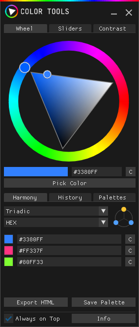
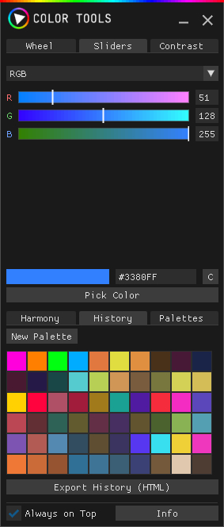
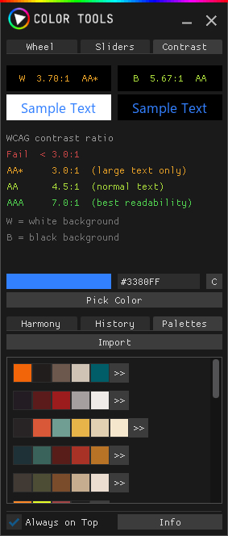

# Color Tools

A compact, always-on-top color picker and palette manager for Windows, built with [DearPyGui](https://github.com/hoffstadt/DearPyGui). Pick colors from anywhere on screen, explore color harmonies, manage palettes, and seamlessly convert them between industry-standard formats — all from a single window.






---

## Features

### Color Picker
- **Tabbed Interface:** Easily switch between the Color Wheel, precision Sliders, and a dedicated Contrast checker.
- **Slider Modes:** RGB, HSL, CMYK, LAB, and Grayscale. All sliders stay perfectly in sync.
- **Screen Pipette:** Press `Alt + P` or click the button to sample a color from anywhere on your screen.
- **Hex Input:** Type or paste a hex code directly (`#RRGGBB` or shorthand `#RGB`).
- **Quick Copy:** One-click copy for the current hex value.

### Palettes & Conversion
- **Universal Palette Converter:** Bridge the gap between different design software. Easily import a palette from one app and export it for another. For example:
  - Convert a **Procreate** (`.swatches`) palette to **Affinity** (`.ase`).
  - Convert a **Photoshop** (`.aco`) palette to **GIMP** (`.gpl`).
- **Supported Formats:** Import and export your palettes in:
  - `.ase` (Adobe Swatch Exchange — Affinity, Illustrator, InDesign)
  - `.aco` (Adobe Color — Photoshop)
  - `.gpl` (GIMP Palette — GIMP, Inkscape, Krita)
  - `.swatches` (Procreate)
  - HTML Report (export only)
- **Drag & Drop:** Drop any supported palette file or image directly onto the window to import it instantly.
- **Import from Image:** Automatically extract and quantize a color palette from any image file (requires Pillow).
- **Advanced Palette Editor:** Reorder colors via drag-and-drop, add new colors, and undo changes.

### Harmony Tab
- **9 Harmony Modes:** Complementary, Split Complementary, Analogous, Triadic, Tetradic, Rectangle, Tints, Shades, and Tones.
- **7 Display Formats:** View colors in HEX, RGB, HSL, HSV, CSS Name, CMYK, or Contrast ratio.

### Contrast Checking
- **WCAG Validation:** Dedicated contrast tab shows contrast ratios against white and black backgrounds, complete with AAA / AA / AA* / Fail ratings.

### History Tab
- Automatically saves the last 60 picked colors.
- Right-click any swatch to remove it.
- Select multiple colors from your history to instantly save them as a new palette.

### General
- **7 Themes:** Dark, Light, Midnight, Mocha, Nord, Solarized, and Black.
- **Always on top:** Toggleable pin-to-top functionality.
- Config and data (history, palettes, window position, theme) are saved automatically to `%APPDATA%\Color Tools\config.json`.

---

## Requirements

- Windows 10 or 11
- Python 3.9 or newer

---

## Installation

```bash
pip install dearpygui pyperclip Pillow
```

> **Note:** Pillow is optional. Without it, image palette import is disabled but everything else works normally.

Then run:

```bash
python color_tools.py
```

---

## Keyboard Shortcuts

| Shortcut | Action |
|----------|--------|
| `Alt + P` | Activate screen eyedropper (pick any color on screen) |

---

## License

MIT — see [LICENSE](LICENSE).
